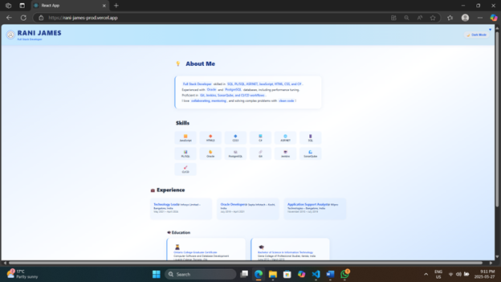

# React Resume

A modern, responsive resume built with React and Tailwind CSS.

## Features

- ⚡ **Built with Vite** (or Create React App)
- 📱 **Responsive design** (mobile-friendly, uses Tailwind breakpoints)
- 🧩 **Component-based**: Header, About, Skills, Experience, Education, Contact, etc.
- 🗂️ **Organized code**: Components in their own folders
- 🔄 **Props**: Data passed into components
- 🎛️ **State & Conditional Rendering**: UI interactivity (expand/collapse, theme, etc.)
- 🗂️ **Dynamic lists**: Uses `.map()` for experiences, skills, etc.
- 🌗 **Dark/Light Theme Toggle**
- ☁️ **Deployed on Vercel with custom domain**: [rani-james.vercel.app](https://rani-james.vercel.app)

## Screenshot



## Getting Started

### 1. Clone the repo

```bash
git clone https://github.com/RaniJames17/Portfolio
cd Portfolio
```

### 2. Install dependencies

```bash
npm install
```

### 3. Run locally

```bash
npm run dev
# or
npm start
```

### 4. Build for production

```bash
npm run build
```

## Deployment

This project is deployed on [rani-james.vercel.app](https://rani-james.vercel.app)


## Project Structure

```
src/
  components/
    Header.jsx
    About.jsx
    Skills.jsx
    Experience.jsx
    Education.jsx
    Contact.jsx
    ThemeToggle.jsx
  App.js
  main.jsx
```

## Key Implementation Details

- **Props** are used in components like `Contact` and `Experience`.
- **useState** is used for UI behavior (e.g., expand/collapse experience, theme toggle).
- **Conditional rendering** is used to show/hide experience details and for theme.
- **.map()** is used to render lists (experiences, skills, etc.).
- **Responsive layout** with Tailwind's responsive classes (e.g., `sm:px-8`, `md:grid-cols-2`).
- **Custom domain**: Uses the format `firstname-lastname.vercel.app`.

## License

MIT

---

> Built by Rani James:500237541